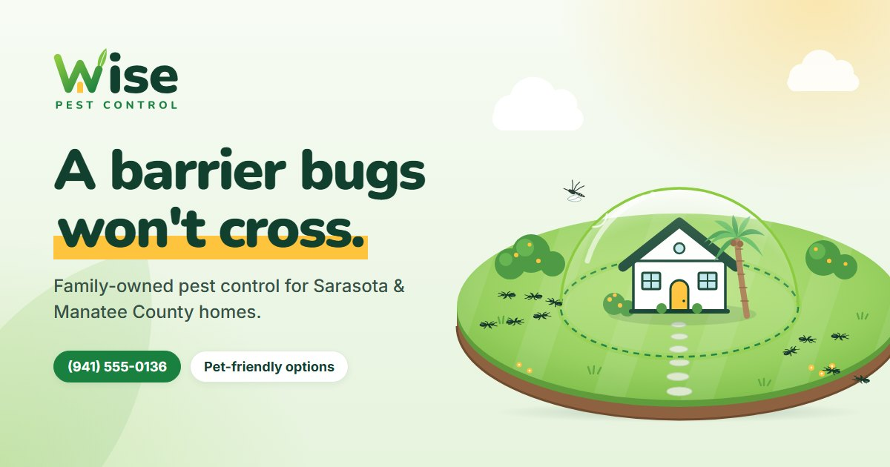

# Wise Pest Control

Marketing website for a Florida pest control company, built as a portfolio piece: logo, brand palette and a one-page site. Plain HTML, CSS and JavaScript, no build step and no dependencies.



## The brand

"Homegrown": the W of Wise is drawn as a house. Its middle peak is the roof over a sunny yellow door, and its last stroke grows into a leaf. Fresh greens and sunshine yellow keep it friendly and family-first.

| Colour | Hex | Used for |
| --- | --- | --- |
| Pine | `#12402F` | Headings, dark sections |
| Leaf | `#1A8040` | Buttons (5:1 with white text), accents |
| Sprout | `#8CCB3F` | Logo gradient, accents on dark |
| Sunshine | `#FFC43D` | The front door, highlights |
| Mint | `#EFF7EC` | Light sections |

Type: **Nunito** Black for headings, **Inter** for body text.

Logo text is converted to vector outlines, so `images/logo.svg` renders identically anywhere, including as an `` and without the fonts installed.

## The hero

The home sits under a clear barrier dome on a round lawn. Ants march toward it and turn back at the treated line, mosquitoes bounce off the dome, and a counter keeps score. Clicking or tapping the lawn sends in more ants, and the sky sends a mosquito. The animation pauses when it scrolls out of view, and visitors who prefer reduced motion get a still frame.

## Running it

Open `index.html` directly, or serve the folder:

```bash
python -m http.server 8000
```

VS Code's Live Server works too. All paths are relative to the project root.

## Structure

```
index.html          one page: hero, services, how it works, plans, why us, reviews, areas, FAQ, quote
css/styles.css      tokens → base → layout → components → sections
js/main.js          mobile menu, scroll reveal, active nav link, hero scene, quote form
images/             logo, favicons, social share image
brand/              logo concept sheet from the exploration round
```

The nav links jump to sections on the one page; there are no separate subpages.

## About the content

The business name is real; everything else is placeholder copy for the demo. The phone number, email, reviews, ratings, prices, home counts and claims such as "licensed & insured" are invented and should be replaced before this is used as a live business site. The copy says "pet-friendly options" rather than "safe", because pest control advertising shouldn't claim that treatments are safe. The quote form validates and shows a confirmation, but sends nothing: there's a marked spot in `js/main.js` for connecting a form service.
